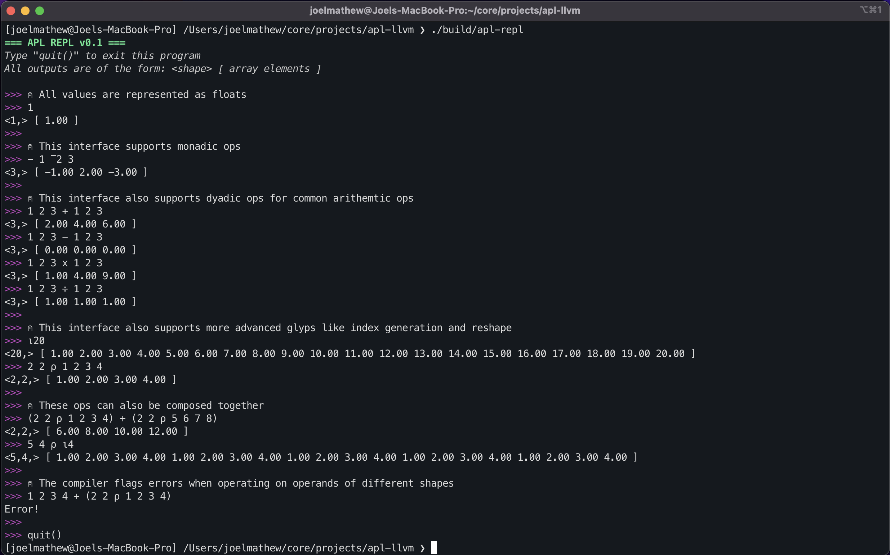

# APL-LLVM

A JIT compiler for the APL programming language built using LLVM. The project exposes a REPL interface with support for a limited set of APL glyphs.



## Setup & Running
```bash
cmake -B build -DLLVM_DIR=<llvm-install-path>
cmake --build build/ --config Release --target apl-repl
./build/apl-repl
```