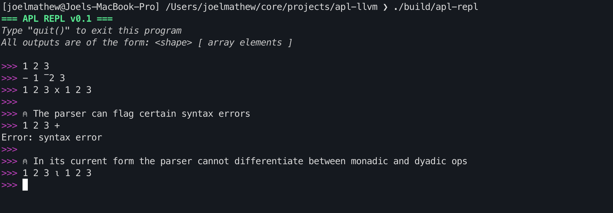

# APL-LLVM

A JIT compiler for the APL programming language built using LLVM. The project exposes a REPL interface with support for a limited set of APL glyphs.

## Stage 4: JIT Compiler

The code in this branch is intended to serve as a reference to those following the Building an APL compiler using LLVM tutorial from my blog.

At the end of this stage, the REPL interface will be capable of compiling and executing input APL programs.



## Setup & Running
```bash
cmake -B build -DLLVM_DIR=/usr/local/Cellar/llvm/21.1.7/
cmake --build build/ --config Release --target apl-repl
./build/apl-repl
```